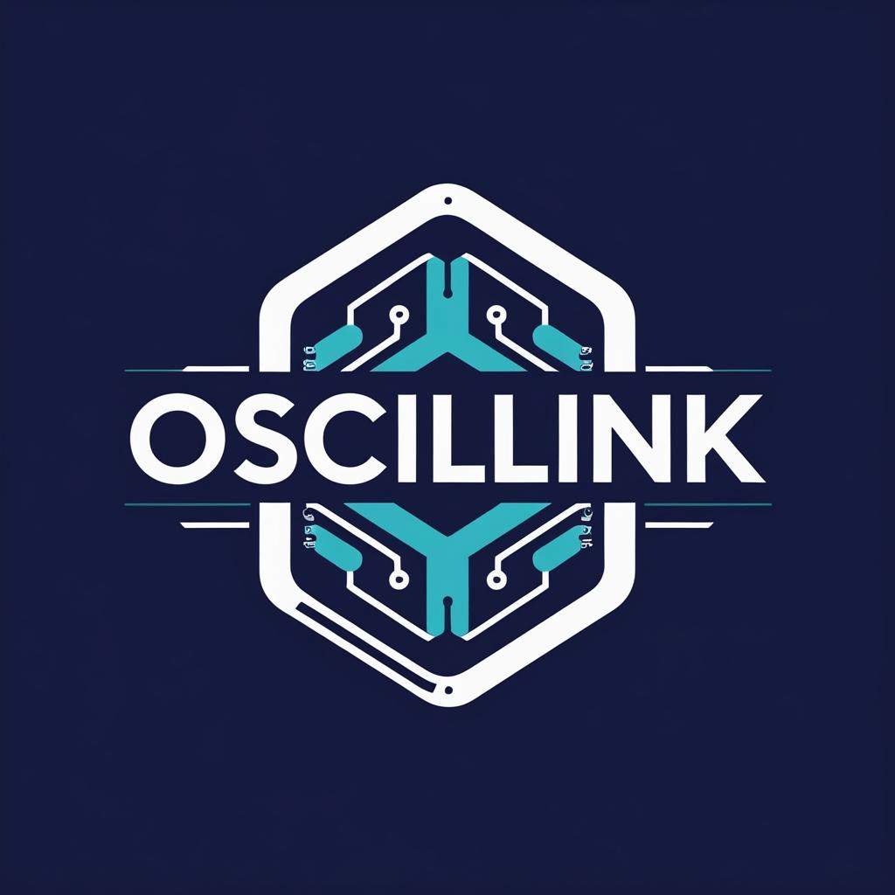

# Oscillink — Self‑Optimizing Coherent Memory for Embedding Workflows

Build coherence into retrieval and generation. Deterministic receipts for every decision. Latency that scales gracefully with corpus size.
<p align="center"></p>

<p align="center"><b>A physics‑inspired, model‑free coherence layer that transforms candidate embeddings into an explainable working‑memory state via convex energy minimization. Deterministic receipts for audit. Conjugate‑gradient solve with SPD guarantees.</b></p>
<p align="center">
	<a href="docs/API.md">API</a> ·
	<a href="docs/foundations/MATH_OVERVIEW.md">Math</a> ·
	<a href="docs/reference/RECEIPTS.md">Receipts</a> ·
	<a href="benchmarks/">Benchmarks</a> ·
	<a href="notebooks/">Notebooks</a> ·
	<a href="https://github.com/Maverick0351a/oscillinkfirm">oscillinkfirm</a>
</p>

--- 

## Contents
- Overview
- Quickstart
- Oscillink Firm (Local LLM)
- Adapters & Compatibility
- Reproducibility
- Performance
- Method (Technical)
- Deployment Options
- Security, Privacy, Legal
- Troubleshooting
- Contributing & License
- Changelog
---
Install: `pip install oscillink` · Docs: [API](docs/API.md) · Math: [Overview](docs/foundations/MATH_OVERVIEW.md) · Receipts: [Schema](docs/RECEIPTS.md)

## Quickstart
System requirements: Python 3.10–3.12, NumPy ≥ 1.22 (1.x/2.x supported). CPU only.

## Oscillink Firm (Local LLM)

What it is

Oscillink Firm is a local retrieval + report system. It runs on a single machine or VM, indexes your firm’s documents (including scanned PDFs), and lets an LLM answer only from that private index. Nothing leaves your environment. Every answer ships a receipt (hashes, ΔH, CG residuals, abstain flags) so you can verify provenance.

What problem it solves

Most “RAG” tools phone home, hallucinate, and can’t prove where an answer came from. Oscillink Firm runs offline, declines to answer when the corpus can’t support it, and proves the source of every citation.

How we solve it (succinct)

- Ingest (local): OCR → chunk → embed → build vector index (JSONL/FAISS).
- Retrieve (local): ANN recall → Oscillink Coherence Engine settles candidates into a coherent working memory.
- Answer (local): Extractive synthesis by default; optional OpenAI‑compatible LLM running locally.
- Receipts (local): Each response/report includes ΔH, CG iters/residual, file/index/model SHA‑256, and abstain flags if coherence is low.

Data we index (no egress)

- Scanned documents & images → OCR (Tesseract via OCRmyPDF).
- PDFs (text) → pdfminer.six.
- Office docs → DOCX, PPTX (paragraphs, slides, speaker notes).
- Plain text & Markdown → .txt, .md (headings preserved).
- Email archives → MBOX/EML (PST via offline export → EML), plus attachments.
- Spreadsheets & CSV → XLSX/CSV (table, header-aware chunking with row‑level retrieval).
- HTML/Confluence exports → saved pages or static export (readability‑style cleanse).
- (Optional regulated formats) HL7 FHIR JSON / CDA excerpts, DICOM metadata (headers only; images omitted unless explicitly enabled).

Access & safety

- Bind to 127.0.0.1.
- No runtime downloads; models verified by SHA‑256.
- Role and matter filters on metadata to restrict retrieval scope.
- Abstain when coherence < ε or top score < τ—no guessing.

What to implement for maximum value (prioritized)

Tier 0 — already high ROI (lock these)

PDFs (text) + Scanned PDFs

Extractors: pdfminer.six; OCRmyPDF (Tesseract).

Deterministic chunking by headings/pages; include page numbers in metadata.

DOCX, TXT/MD, PPTX

Keep heading hierarchy; for PPTX include slide text + notes.

Chunk by section/slide; attach section_title, slide_index.

XLSX/CSV (table-aware)

Parse headers, normalize types, one row = one retrievable unit with a compact text rendering.

Include sheet, row_index, and key columns in metadata.

Why: These cover 80% of firm knowledge and make your demos obviously useful.

Tier 1 — unlock “hidden knowledge” (biggest next leap)

Email archives with attachments (offline)

Sources: MBOX/EML (and PST→EML via local export).

Extract: subject, from/to/date, body, attachments (then push attachments back through the same ingest).

Thread grouping: thread_id, message_index.

High value because institutional memory often lives in email.

HTML / Confluence static export

Strip boilerplate; preserve heading hierarchy and table content.

Tag with space, page_title, last_modified.

Why: Captures “tribal knowledge” that never made it into PDFs.

Tier 2 — regulated & specialized (offer as add‑ons)

Healthcare

FHIR JSON (e.g., DocumentReference, Observation, Condition) → index textual fields only; apply PHI tagging and policy filters.

CDA (clinical notes) → text body only; redact detected PHI tokens as configured.

DICOM → metadata headers only by default (PatientName/ID redacted or hashed).

Legal / eDiscovery

Load files (e.g., OPT/DAT) to reconstruct doc families; maintain family_id, bates ranges.

Connect to on‑prem DMS exports (iManage/NetDocuments via filesystem export, not live API at first).

Why: These win you specific industries without overhauling the core.

Implementation details that matter (so it “just works”)

Metadata schema (uniform across all connectors)

collection, doc_id, chunk_id, source_type, path, title, author,
created_at, modified_at, page_or_row, section, tags[],
model_name, model_sha256, dim, file_sha256

Add ACL tags: matter_id, client_id, department, role_required.

Index filters: year, company/client, matter, document type.

Deterministic ingest

Stable ordering and tie‑breaks.

Record exact parser/OCR versions and embed model hash in an IngestReceipt, chained into the SettleReceipt.

Email specifics

Normalize to UTF‑8, strip quoted reply blocks (keep one level optionally).

Store message‑level embeddings and also attachment embeddings as separate chunks linked back to the parent message.

De‑dup via content hash to avoid storing identical attachments.

Spreadsheet specifics

Respect header row; compact each row into “key=value” text with a max token budget; attach top 3 salient columns as facets for filtering.

Add a table preview (first N rows) to the sidecar report for transparency.

HTML/Confluence specifics

Use readability‑style boilerplate removal; keep H1‑H3 hierarchy.

Preserve code blocks and tables as plain text plus a small JSON “shape” in metadata.

Regulated data controls

PHI/PII detectors (local regex + small ML model if available) with three modes: tag, mask, block.

Receipt flag: contains_phi: true|false with a count (no raw values in receipts).

What not to do (now)

Live IMAP/Graph connectors that require continuous network access—start with offline exports.

Full DICOM pixel OCR—leave imaging to future modules; start with headers only.

Complex collaborative editing—keep the UI minimal; focus on solid retrieval + receipts.

“Most value” backlog (4‑week, aggressive)

Week 1:

Finalize PDFs (text+OCR), DOCX, TXT/MD, PPTX; uniform metadata; receipts chaining.

Table‑aware CSV/XLSX (row retrievability + facets).

Week 2:

Email (MBOX/EML + attachments).

HTML/Confluence static export.

Week 3:

ACL filters (matter/client/department) enforced at query time.

Proof pack polishing: determinism tests and report sidecars for each connector.

Week 4:

Healthcare/legal add‑ons behind flags (FHIR/CDA text fields; DICOM metadata; eDiscovery load‑file mapping).

Basic PHI/PII tag/mask/block policy.

Acceptance on each item =

deterministic ingest receipts,

reproducible recall→settle latency within target,

and abstain working when context is weak.

How to frame this in the README (crisp)

Local LLM on your firm’s data

Oscillink Firm indexes your scanned documents, PDFs, Office files, emails (with attachments), spreadsheets/CSV, and HTML/Confluence exports—all on your hardware. The LLM answers only from this private index.
Every answer includes a receipt with hashes and coherence metrics. If the corpus doesn’t support an answer, the system abstains.

---

See also: [Implementation plan](docs/IMPLEMENTATION_PLAN.md)
## Adapters & Compatibility

---
## Deployment Options

### A. SDK (local)
### B. Licensed container (customer‑managed)

### C. Cloud API (beta)
Cloud feature flags, quotas, and Stripe onboarding are documented under `docs/`:

- Cloud architecture & ops: `docs/cloud/CLOUD_ARCH_GCP.md`, `docs/ops/REDIS_BACKEND.md`
- Billing: `docs/billing/STRIPE_INTEGRATION.md`, `docs/billing/PRICING.md`
## Security, Privacy, Legal

Policies: [Security](SECURITY.md) · [Privacy](docs/product/PRIVACY.md) · [Terms](docs/product/TERMS.md) · [License](LICENSE) · [Patent notice](PATENTS.md)
## Troubleshooting

---
## Contributing & License

---
## Changelog

---
## Appendix: Datasets and Notebooks

---
## Pricing (licensed container)

---
## References

Build coherence into retrieval and generation. Deterministic receipts for every decision. Latency that scales gracefully with corpus size.

<p align="left">
	<a href="https://github.com/Maverick0351a/Oscillink/actions/workflows/ci.yml"></a>
	<a href="https://github.com/Maverick0351a/Oscillink/actions/workflows/codeql.yml"></a>
	<a href="https://github.com/Maverick0351a/Oscillink/actions/workflows/pip-audit.yml"></a>
	<a href="https://app.codecov.io/gh/Maverick0351a/Oscillink/tree/main"></a>
	<a href="https://pypi.org/project/oscillink/"></a>
	<a href="https://pypi.org/project/oscillink/"></a>
	<a href="https://pypi.org/project/oscillink/"></a>
	<a href="LICENSE"></a>
	<a href="PATENTS.md"></a>
	<a href="docs/foundations/MATH_OVERVIEW.md"></a>
	<br/>
	<sub>CI: Python 3.10–3.12 × NumPy 1.x/2.x</sub>

</p>

<p align="center">
  <a href="https://pypi.org/project/oscillink/"></a>
</p>

<p align="center"><b>A physics‑inspired, model‑free coherence layer that transforms candidate embeddings into an explainable working‑memory state via convex energy minimization. Deterministic receipts for audit. Conjugate‑gradient solve with SPD guarantees.</b><br/>
<code>pip install oscillink</code></p>

Setup: synthetic “facts + traps” dataset — see the notebook for N, k, trials, seed. Reproducible via `notebooks/04_hallucination_reduction.ipynb`. Traps flagged; gate=0.01, off‑topic damp=0.5.

- Latency scales smoothly: with fixed D, k, and CG tol, settle tends to remain stable with denser graphs. Reference E2E < 40 ms at N≈1200 on a laptop CPU.
- Hallucination control: in our controlled study[1], Oscillink reduced trap selections while maintaining competitive F1. See the notebook for setup and reproduction.
- Receipts: SHA‑256 state signature; optional HMAC‑SHA256. [schema](docs/reference/RECEIPTS.md)
- Universal: works with any embeddings, no retraining. [adapters](#adapters--model-compatibility) · [quickstart](examples/quickstart.py)
- Self‑optimizing: learns parameters over time. [adaptive suite](scripts/bench_adaptive_suite.py)
- Production: scales to millions. See scripts under `scripts/` for reproducible benchmarks.

<p>
	<a href="#quickstart">Get Started</a> · <a href="docs/reference/API.md">API Docs</a> · <a href="#proven-results">See Results</a> · <a href="notebooks/">Live Demos</a>
</p>

<p align="center">
	<a href="https://github.com/Maverick0351a/Oscillink/actions/workflows/ci.yml">CI</a> ·
	<a href="https://pypi.org/project/oscillink/">PyPI</a> ·
	<a href="docs/reference/API.md">API</a> ·
	<a href="docs/foundations/MATH_OVERVIEW.md">Math</a> ·
	<a href="docs/reference/RECEIPTS.md">Receipts</a> ·
	<a href="benchmarks/">Benchmarks</a> ·
	<a href="notebooks/">Notebooks</a>
</p>

---

## Contents

- Overview
- Quickstart
- Adapters & Compatibility
- Reproducibility
- Performance
- Method (Technical)
- Deployment Options
- Security, Privacy, Legal
- Troubleshooting
- Contributing & License
- Changelog

---
pip install oscillink
# Oscillink — Self‑Optimizing Coherent Memory for Embedding Workflows

Build coherence into retrieval and generation. Deterministic receipts for every decision. Latency that scales gracefully with corpus size.

<p align="left">
  <a href="https://github.com/Maverick0351a/Oscillink/actions/workflows/ci.yml"></a>
  <a href="https://github.com/Maverick0351a/Oscillink/actions/workflows/codeql.yml"></a>
  <a href="https://github.com/Maverick0351a/Oscillink/actions/workflows/pip-audit.yml"></a>
  <a href="https://app.codecov.io/gh/Maverick0351a/Oscillink/tree/main"></a>
  <a href="https://pypi.org/project/oscillink/"></a>
  <a href="https://pypi.org/project/oscillink/"></a>
  <a href="https://pypi.org/project/oscillink/"></a>
  <a href="LICENSE"></a>
  <a href="PATENTS.md"></a>
  <a href="docs/foundations/MATH_OVERVIEW.md"></a>
  <br/>
  <sub>CI: Python 3.10–3.12 · NumPy 1.x/2.x</sub>
</p>

<p align="center"></p>

Abstract. Oscillink is a physics‑inspired, model‑free coherence layer that transforms a set of candidate embeddings into an explainable working‑memory state by minimizing a strictly convex energy on a mutual‑kNN lattice. The system solves a symmetric positive‑definite (SPD) linear system via preconditioned conjugate gradients (CG), returning (i) refined embeddings U*, (ii) a deterministic, signed “receipt” with energy improvement ΔH, and (iii) per‑edge/null‑point diagnostics. No training is required; your embeddings are the model.

Install: `pip install oscillink` · Docs: [API](docs/API.md) · Math: [Overview](docs/foundations/MATH_OVERVIEW.md) · Receipts: [Schema](docs/RECEIPTS.md)

---

## Contents

- Overview
- Quickstart
- Adapters & Compatibility
- Reproducibility
- Performance
- Method (Technical)
- Deployment Options
- Security, Privacy, Legal
- Troubleshooting
- Contributing & License
- Changelog

---

## Overview

Oscillink builds a transient mutual‑kNN graph over N×D anchors `Y` and settles to a unique global optimum of a convex energy. The result is a coherent bundle of items for a query `psi`, along with an auditable “receipt” that explains the decision.

Outputs per run:

- Refined state U* (coherent embeddings)
- Receipt with ΔH (energy drop), term breakdown, CG iterations/residuals, and a SHA‑256 state signature (optional HMAC)
- Diagnostics: null points (incoherent edges), chain/prior scores (optional)

The system is deterministic, explainable, and training‑free.

---

## Quickstart

Minimal, 60 seconds:

```bash
pip install oscillink
python - <<'PY'
import numpy as np
from oscillink import Oscillink

# Anchors (N x D, float32) and a D-dim query
Y = np.random.randn(80,128).astype('float32')
psi = (Y[:10].mean(0) / (np.linalg.norm(Y[:10].mean(0))+1e-9)).astype('float32')

lat = Oscillink(Y, kneighbors=6, lamG=1.0, lamC=0.5, lamQ=4.0)
lat.set_query(psi)
lat.settle()

print("top-5:", [(b.get("id", i), round(b["score"],3)) for i,b in enumerate(lat.bundle(k=5))])
print("ΔH:", lat.receipt()["deltaH_total"])
PY
```

System requirements: Python 3.10–3.12, NumPy ≥ 1.22 (1.x/2.x supported). CPU only.

SDK at a glance:

```python
from oscillink import Oscillink

# Y: (N, D) embeddings; psi: (D,) query (float32 recommended)
lattice = Oscillink(Y, kneighbors=6)
lattice.set_query(psi)
lattice.settle()
bundle  = lattice.bundle(k=5)   # coherent top-k
receipt = lattice.receipt()     # deterministic audit (energy breakdown)
```

Scoring modes. Bundle ranking supports two equivalent formulations:
- Legacy (default): `score = alpha*z(coherence_drop) + (1-alpha)*cos(U*_i, psi)`
- Paper mode: `score = alpha*cos(U*_i, psi) + (1-alpha)*z(coherence_drop)`

Toggle via environment `OSCILLINK_BUNDLE_MODE=paper|legacy` without code changes.

Gating. You can gate participation with diffusion‑based gates in [0,1]:

```python
from oscillink import compute_diffusion_gates
gates = compute_diffusion_gates(Y, psi, gamma=0.1, beta=1.0)
lattice.set_gates(gates)
```

---

## Adapters & Compatibility

- Embeddings: Bring your own (OpenAI, Cohere, Sentence‑Transformers, local). Shapes: `Y: (N, D)`, `psi: (D,)`, preferably near unit‑norm float32.
- Dependencies: NumPy + small helpers; no framework lock‑in.
- Adapters: see `oscillink.adapters.*` for simple text embedding utilities.
- Tuning: Practical knobs are `kneighbors`, `lamC`, `lamQ`. CLI `--tune` and the adaptive suite offer data‑driven defaults.
- Preprocessing: optional `smart_correct` can reduce incidental traps in noisy inputs.
- Platforms: Windows, macOS, Linux.

---

## Reproducibility

Claim → how to reproduce (scripts write JSON or plots):

| Claim | How to reproduce |
|---|---|
| Coherence vs cosine baseline on provided sample | `python scripts/competitor_benchmark.py --input examples/real_benchmark_sample.jsonl --format jsonl --text-col text --id-col id --label-col label --trap-col trap --query-index 0 --k 5 --json --out benchmarks/competitor_sample.json` then `python scripts/plot_benchmarks.py --competitor benchmarks/competitor_sample.json --out-dir assets/benchmarks` |
| Scaling timing vs N | `python scripts/scale_benchmark.py --N 400 800 1200 --D 64 --k 6 --trials 2 > benchmarks/scale.jsonl` then `python scripts/plot_benchmarks.py --scale benchmarks/scale.jsonl --out-dir assets/benchmarks` |
| Receipt proof (energy, signature) | `pip install -e .[dev]` then `python scripts/proof_hallucination.py --seed 123 --n 1200 --d 128` |

Notes: The “facts + traps” setup used in the notebook is a controlled study to demonstrate controllability and auditability. Evaluate on your corpus before drawing production conclusions.

---

## Performance

Reference (laptop, Python 3.11, NumPy BLAS, N≈1200, light receipts):

- Graph build: ~18 ms
- Settle: ~10 ms
- Receipt: ~3 ms

Total: under ~40 ms.

As N grows (fixed D, k, tol), CG typically converges in 3–4 iterations with Jacobi preconditioning; end‑to‑end times scale smoothly.

Complexity: one matvec is O(Nk); overall solve ≈ O(D · cg_iters · N · k).

---

## Method (Technical)

Oscillink minimizes a convex energy on a mutual‑kNN lattice:

$$
H(U)=\lambda_G\|U-Y\|_F^2+\lambda_C\,\mathrm{tr}(U^\top L_{\mathrm{sym}}U)+\lambda_Q\,\mathrm{tr}\big((U-\mathbf{1}\psi^\top)^\top\,B\,(U-\mathbf{1}\psi^\top)\big)
$$

with optional path prior term $\lambda_P L_{\text{path}}$. Normal equations yield an SPD system $MU^*=F$ with

$$
M=\lambda_G I+\lambda_C L_{\mathrm{sym}}+\lambda_Q B+\lambda_P L_{\text{path}},\quad F=\lambda_G Y+\lambda_Q B\,\mathbf{1}\psi^\top.
$$

Properties. If $\lambda_G>0$ and $L_{\mathrm{sym}}, B, L_{\text{path}}$ are symmetric PSD, then $M$ is SPD ⇒ unique minimizer $U^*$. We solve with Jacobi‑preconditioned CG. Each run emits a receipt with $\Delta H$, per‑term energy, CG stats, and a SHA‑256 state signature (optional HMAC).

More detail: [Foundations / Math Overview](docs/foundations/MATH_OVERVIEW.md)

---

## Deployment Options

### A. SDK (local)

Keep everything in‑process. See Install and examples under `examples/`.

### B. Licensed container (customer‑managed)

Run the API entirely inside your VPC/cluster. No embeddings or content leave your network; only license/usage heartbeats if enabled.

<details>
<summary>Container quickstart and operations (click to expand)</summary>

#### Quickstart (Docker)

1) Place a license at `deploy/license/oscillink.lic` (Ed25519‑signed JWT).

```bash
docker compose -f deploy/docker-compose.yml up -d
```

API: http://localhost:8000 · health: `/health` · license status: `/license/status`

#### Required env

- `OSCILLINK_LICENSE_PATH` (default `/run/secrets/oscillink.lic`)
- `OSCILLINK_JWKS_URL` (e.g., https://license.oscillink.com/.well-known/jwks.json)

#### Optional

- `OSCILLINK_TELEMETRY=minimal` (aggregated counters only)
- `OSCILLINK_USAGE_LOG=/data/usage.jsonl`
- `OSCILLINK_USAGE_FLUSH_URL` (batch upload)
- JWT verification knobs: `OSCILLINK_JWT_ISS`, `OSCILLINK_JWT_AUD`, `OSCILLINK_JWT_LEEWAY`, `OSCILLINK_JWKS_TTL`, `OSCILLINK_JWKS_OFFLINE_GRACE`

#### Redis (optional)

- `OSCILLINK_STATE_BACKEND=redis` — enable Redis-backed app state (e.g., rate limits, quotas, caches)
- `OSCILLINK_REDIS_URL=redis://localhost:6379/0` — Redis connection string (alternatively, set `REDIS_URL`)

See `docs/ops/REDIS_BACKEND.md` for details and production guidance.

#### Kubernetes (Helm)

- Chart skeleton at `deploy/helm/oscillink`.
- Mount secret to `/run/secrets/oscillink.lic`, set `OSCILLINK_LICENSE_PATH` and `OSCILLINK_JWKS_URL`.
- Optional hardening: NetworkPolicy, PDB, HPA, Ingress.

#### Operator introspection

```bash
# set OSCILLINK_ADMIN_SECRET before running the container
curl -H "X-Admin-Secret: $OSCILLINK_ADMIN_SECRET" http://localhost:8000/admin/introspect
```

Metrics protection: set `OSCILLINK_METRICS_PROTECTED=1` (requires X‑Admin‑Secret on `/metrics`).

</details>

### C. Cloud API (beta)

Opt‑in hosted API for convenience. Obtain an API key and call:

```python
import os, httpx
API_BASE = os.environ.get("OSCILLINK_API_BASE", "https://api2.odinprotocol.dev")
API_KEY  = os.environ["OSCILLINK_API_KEY"]
r = httpx.post(
	f"{API_BASE}/v1/settle",
	json={"Y": [[0.1,0.2]], "psi": [0.1,0.2], "options": {"bundle_k": 1, "include_receipt": True}},
	headers={"X-API-Key": API_KEY},
)
print(r.json())
```

Cloud feature flags, quotas, and Stripe onboarding are documented under `docs/`:

- Cloud architecture & ops: `docs/cloud/CLOUD_ARCH_GCP.md`, `docs/ops/REDIS_BACKEND.md`
- Billing: `docs/billing/STRIPE_INTEGRATION.md`, `docs/billing/PRICING.md`

---

## Security, Privacy, Legal

- Local SDK: does not transmit embeddings/content anywhere.

---

## Minimal on‑prem HTTP query service

For air‑gapped or on‑prem setups that only need retrieval over a prebuilt index, we include a tiny FastAPI app that wraps the programmatic query API:

- Server module: `examples/query_server.py`
- Endpoints:
  - POST /v1/query — top‑k vector search against a JSONL or FAISS index
  - POST /v1/query-e2e — JSONL only; runs recall→settle and returns a bundled context and receipt

Quickstart (install extras first):

1) Install cloud extras
	pip install -e .[cloud]

2) Start the server
	uvicorn examples.query_server:app --host 0.0.0.0 --port 8080

3) Query it
	curl -X POST http://localhost:8080/v1/query -H "Content-Type: application/json" -d '{"index_path":"/path/to/index.jsonl","q":"what is the topic?","backend":"jsonl","k":6}'

For FAISS, pass `"backend":"faiss"` and `"meta_path":"/path/to/index.meta.jsonl"`.

<!-- Pruned legacy duplication below -->
